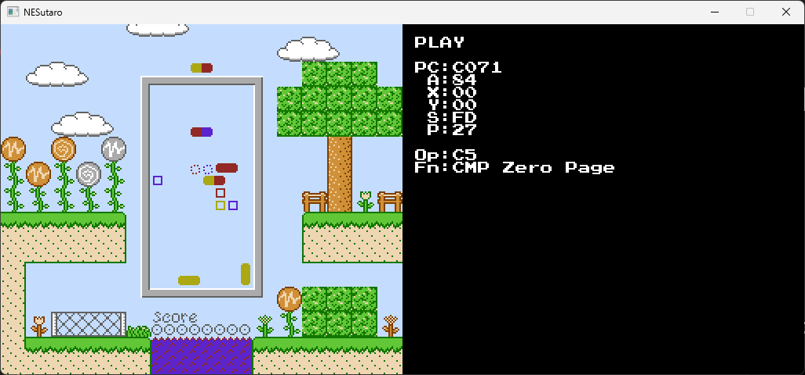

# NESutaro

## Description

This is a **NES emulator** written in **Go**, using **Ebiten**.  
It was developed with assistance from **ChatGPT**.

⚠️ This emulator is developed for learning purposes. So, it's still a work in progress and **contains many bugs**.  
🔇 Sound is **not supported**.  
🎮 Only **NROM** mapper is supported.

---

## How to Launch

    go run ./cmd/nesutaro/main.go <rom_path>

---

## How to Change Settings

Edit the configuration file:

    ./config.toml

---

## Default Game Button Bindings

| Game Boy | Key |
|----------|-----|
| A        | Z |
| B        | X |
| SELECT   | Left Shift |
| START    | Enter |
| D-Pad    | Arrow Keys |

---

## Emulator Control Keys

| Action | Key |
|--------|-----|
| Toggle Pause / Run | P |
| Step (while paused) | S |
| Exit | Esc |

---

## Playable / Passed ROMs

- Squirrel Domino
- Argon Dream
- nestest.nes 
